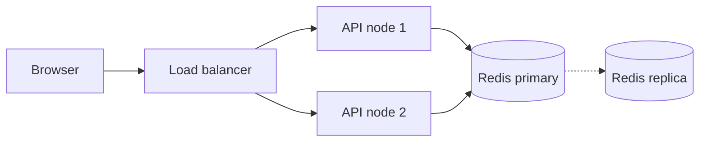
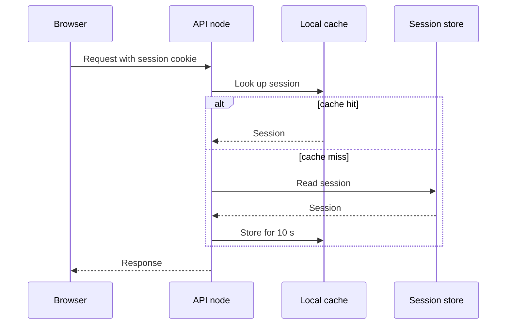

# Session storage redesign

- Status: In review
- Owner: platform team
- Related: #412, #455, #470

## Summary

Sessions are stored in a single Redis primary today. Failover takes about two minutes, drops every active session and forces users to sign in again. This document proposes moving sessions to a replicated store and reading them through a small cache in each API node.

## Current design



### Constraint 1

Constraint 1 limits how quickly a node can recover after a restart. The node must reload its routing table, re-establish connections to the session store and warm the local cache before it accepts traffic again.

- Recovery target: 8 seconds
- Owner: team A
- Monitored by the `session_recovery_seconds` metric

### Constraint 2

Constraint 2 limits how quickly a node can recover after a restart. The node must reload its routing table, re-establish connections to the session store and warm the local cache before it accepts traffic again. Measurements from the last incident show the warm-up alone took 14 seconds.

- Recovery target: 16 seconds
- Owner: team B
- Monitored by the `session_recovery_seconds` metric

### Constraint 3

Constraint 3 limits how quickly a node can recover after a restart. The node must reload its routing table, re-establish connections to the session store and warm the local cache before it accepts traffic again.

- Recovery target: 24 seconds
- Owner: team C
- Monitored by the `session_recovery_seconds` metric

### Constraint 4

Constraint 4 limits how quickly a node can recover after a restart. The node must reload its routing table, re-establish connections to the session store and warm the local cache before it accepts traffic again.

- Recovery target: 32 seconds
- Owner: team D
- Monitored by the `session_recovery_seconds` metric

### Constraint 5

Constraint 5 limits how quickly a node can recover after a restart. The node must reload its routing table, re-establish connections to the session store and warm the local cache before it accepts traffic again. Measurements from the last incident show the warm-up alone took 35 seconds.

- Recovery target: 40 seconds
- Owner: team E
- Monitored by the `session_recovery_seconds` metric

### Constraint 6

Constraint 6 limits how quickly a node can recover after a restart. The node must reload its routing table, re-establish connections to the session store and warm the local cache before it accepts traffic again.

- Recovery target: 48 seconds
- Owner: team F
- Monitored by the `session_recovery_seconds` metric

## Proposal

| Option | Latency | Cost | Operational load |
| --- | --- | --- | --- |
| Keep Redis primary | 1 ms | Low | High |
| Redis with replicas | 1 ms | Medium | Medium |
| Managed key-value store | 3 ms | Medium | Low |
| Database table | 9 ms | Low | Low |

We choose the managed key-value store. It removes the manual failover and its latency stays within the budget of the login endpoint.



## Rollout

1. Enable dual writes for cohort 1 and compare the read results for one day.

2. Enable dual writes for cohort 2 and compare the read results for one day.

3. Enable dual writes for cohort 3 and compare the read results for one day.

4. Enable dual writes for cohort 4, compare the read results for one day and review the error budget.

5. Enable dual writes for cohort 5 and compare the read results for one day.

6. Enable dual writes for cohort 6 and compare the read results for one day.

7. Enable dual writes for cohort 7 and compare the read results for one day.

8. Enable dual writes for cohort 8 and compare the read results for one day.


## Configuration

```yaml
sessions:
  store: managed-kv
  cache:
    ttl_seconds: 10
    max_entries: 50000
  timeouts:
    read_ms: 20
    write_ms: 50
```

## Risks

- Risk 1: the migration job for shard 1 may lag behind the dual writes when traffic peaks, which would make reads fall back to the old store.

- Risk 2: the migration job for shard 2 may lag behind the dual writes when traffic peaks, which would make reads fall back to the old store.

- Risk 3: the migration job for shard 3 may lag behind the dual writes when traffic peaks, which would make reads fall back to the old store. An alert fires when the lag exceeds five minutes.

- Risk 4: the migration job for shard 4 may lag behind the dual writes when traffic peaks, which would make reads fall back to the old store.

- Risk 5: the migration job for shard 5 may lag behind the dual writes when traffic peaks, which would make reads fall back to the old store.

- Risk 6: the migration job for shard 6 may lag behind the dual writes when traffic peaks, which would make reads fall back to the old store.

- Risk 7: the migration job for shard 7 may lag behind the dual writes when traffic peaks, which would make reads fall back to the old store. An alert fires when the lag exceeds five minutes.

- Risk 8: the migration job for shard 8 may lag behind the dual writes when traffic peaks, which would make reads fall back to the old store.

- Risk 9: the migration job for shard 9 may lag behind the dual writes when traffic peaks, which would make reads fall back to the old store.

- Risk 10: the migration job for shard 10 may lag behind the dual writes when traffic peaks, which would make reads fall back to the old store.


## Open questions

- Should the cache be shared between processes on one node?
- Who owns the dashboard and the alerts?
- Do we need a kill switch per region?

